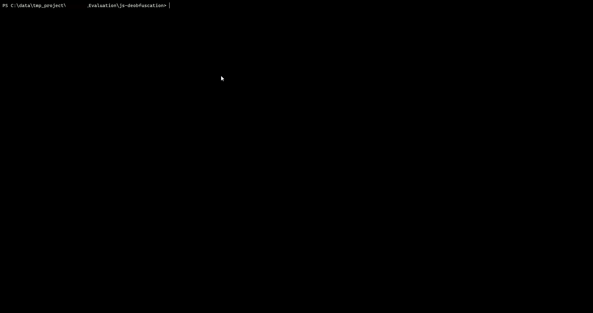

# Description
A NodeJS sample program to de-obfuscate javascript code obfuscated by **obfuscator.io (javascript-obfuscator)**.

It showcases an example of deobfuscation through the use of BabelJS to parse, evaluate and generate new clean code.

The program deobfuscates an obfuscation with the following parameters:
 * Self defending
 * Control flow flattening
 * Dead code injection

Note: works *only* with the configuration above, to use effectively try on different samples and tackle edge cases.

# Usage
```bash
./js-deobfuscator samples/iroot.js > deobfuscated_iroot.js
```
# Example

